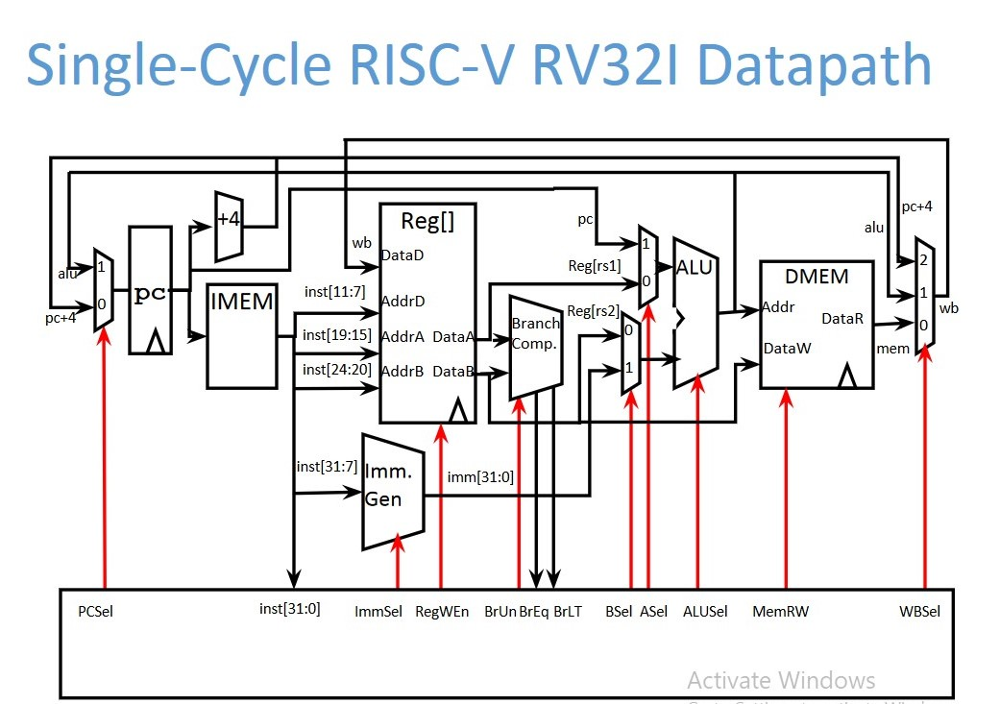

# rv32im_zmmul
RISC-V ```rv32im_zmmul``` VHDL implementation

https://github.com/bitbytebitco/rv32im_zmmul/assets/45221627/18036b1a-ddf8-41e8-9883-ab2dce9460de

# Datapath
_This is an approximation (there are some modifications to this)_
<details>
  <summary>Diagram (click to reveal)</summary>
  

</details>

# Status Updates  
<details>
  <summary>07/28/23 - Added I2C </summary>
  
  + I2C (Master Write) module added, which simulates and synthesizes.
  + Capable of sending single & multiple bytes at 100 kHz. 
</details>
<details>
  <summary>07/21/23 - Initial Report (Blinky) </summary>
  
  + Basic blinking led program properly synthesized and implemented on Basys 3
    + Using 50 MHz CPU clock  
  + ```zmmul``` instructions not yet implemented 
  + Remaining instructions of rv32i todo
    + https://docs.google.com/document/d/11gn7-yY5YjZeH5jf3WMUH8FKyT9lCqL0K3gcKlKGxgU/edit?usp=sharing
</details>

# Testing
## Hello, World! (Blinking LED)
<details>
  <summary>Simulation Waveform</summary>
  
  
</details>
<details>
  <summary>Assembly Program (RISCV) </summary>
  
  ```
  addi x4, x0, 1
  addi x2, x2, 1
  bltu x2, x4, -4
  xori x8, x8, 0xFFFFFFFF
  sw x8, 0(x5)                         -- x5 holds address of GPIO
  addi x2, x2, -1
  bltu x2, x4, -24  
  ```
</details>
<details>
  <summary>Synthesis Waveform</summary>
  
  #### Synthesized Oscilloscope Output (50 MHz CPU Clock)
  
</details>

## I2C Implementation
<details>
  <summary>Operating Procedures</summary>
  
#### Single-Byte Procedure:

+ set ```i_addr``` (slave address)
+ set ```i_buffer_clear``` HIGH
+ set ```i_tx_byte``` (byte to be sent)
+ set ```i_byte_cnt``` to 1
+ set ```i_en``` HIGH
+ poll ```o_done```
  + if ```o_done``` HIGH then set ```i_done_clear``` HIGH
  + This should generate stop condition


#### Multi-Byte Procedure:

+ set ```i_addr``` (slave address)
+ set ```i_tx_byte``` (first byte to be sent)
+ set ```i_byte_cnt``` to # bytes
+ set ```i_en``` HIGH
+ poll ```o_buffer_clear```
  + if ```o_buffer_clear``` HIGH then
  + update ```i_tx_byte``` with next byte to be sent
  + set ```i_buffer_clear``` HIGH to allow system to continue

</details>

<details>
  <summary>RISCV Assembly Example</summary>
  
  #### RISCV Assembly
  ```
  addi x12, x0, 0x0A                                 set x12 to 0x0A (first byte to be sent)
  sb x12, 0x0400(x0)                                 set I2C current byte (r_i2c_current_data)
  addi x11, x0, 0x0B                                 set x11 to 0x0B (second byte to be sent)
  addi x2, x0, 0x02                                  (set x2 to 0x02 for byte count)
  sb x2, 0x0401(x0)                                  set I2C byte count (r_i2c_byte_cnt)
  addi x9, x0, 0x03                                  (set x9 for i2c_ctrl_wrd values 'active'=1  and 'i_buffer_clear'=1)
  addi x1, x0, 0x01                                  (set x1 to 1 for use in activating i2c and checking states)
  addi x4, x0, 0x70                                  (set x4 to i2c_addr value)
  sb x4, 0x0404(x0)                                  Set i2c_addr (x404) to device address 0x70
  sb x1, 0x0403(x0)                                  Set i2c_ctrl_wrd (x403) to value at x1 (x"00000001") to ENABLE I2C
  lw x6, 0x0402(x0)                                  load i2c_stat to x6
  beq x6, x1, 40                                     if o_done == 1 then jump forward 10 instructions
  andi x3,x6,0x04                                    set x3 to AND of x6 and BIT2 (testing o_busy)
  srl x3,x3,x2                                       shift right by two
  bltu x3, x1, -16                                   if o_busy < 1 then jump back 4 instructions
  andi x7,x6,0x02                                    set x7 to logical AND of x6 and BIT1 (testing o_buffer_clear)
  srl x7,x7,x1                                       shift right by one
  bltu x7, x1, -28                                   if o_buffer_clear < 1 jump back 6 instructions
  sb x11, 0x0400(x0)                                 set data memory address 0x400 to update (next byte to be sent)
  sb x9, 0x0403(x0)                                  Set i2c_ctrl_wrd (x403) to value at x9  ('active'=1  and 'i_buffer_clear'=1)
  bltu x0, x1, -40                                   jump back 10 instructions
  addi x5, x0, 0x05                                  set x5 to 0x05 (for the next instruction)
  sb x5, 0x0403(x0)                                  Set i2c_ctrl_wrd (x403) to 0b00000101 (`i_done_clear` = 1 and `active` = 1)
  bltu x0, x1, -84                                   jump back to start ( back 21 instructions)    
  ```
</details>

<details>
  <summary>Waveform Screenshots</summary>
  
#### Simulation Waveform (50 MHz CPU Clock)

  
#### Synthesized Oscilloscope Output (50 MHz CPU Clock)


</details>

## Bootloading
<details>
    <summary>Overview</summary>
  
#### Overview on how to bootload an assembly program:

+ Restart system (currently I'm using VIO)
+ Switch(0) needs to be HIGH
    + This halts the PC and puts `i_load_imem` HIGH
+ Use UART Serial to send bytes 
    + 115200 @ 8-N-1
+ Switch(0) LOW to run PC from 0x00
</details>
<details>
    <summary>Using the Makefile & Python UART Script</summary>
  
#### How to bootload using the Makefile and Python UART Script:

+ Restart system (currently I'm using VIO)
+ Switch(0) needs to be HIGH
    + This halts the PC and puts `i_load_imem` HIGH
+ At a linux terminal:
  + ```BASENAME=fp_add make hex```
    + Assuming there is a riscv assembly file ```fp_add.S```
    + This Makefile diassembles hex to a file [BASENAME].dump (fp_add.dump)
  + ```sudo bytes_to_uart.py fp_add.dump```
    + This python script parses each line's 32-bit hex instruction and sends each byte little-endian ordered
+ Switch(0) LOW to run PC from 0x00
</details>


## Bash commands to compile,link, and disassemble hex instructions 
```
    riscv32-unknown-elf-gcc -g -ffreestanding -O0 -Wl,--gc-sections -fno-toplevel-reorder -nostartfiles -nostdlib -nodefaultlibs -Wl,-T,c_linker.ld crt0.S main.c -o main.elf
    riscv32-unknown-elf-objdump -drwC -S main.elf > main.dump
```

